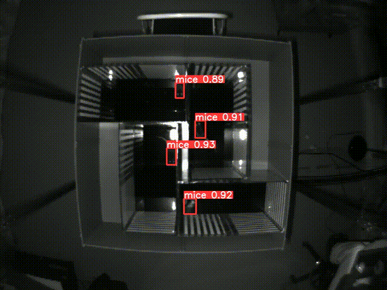
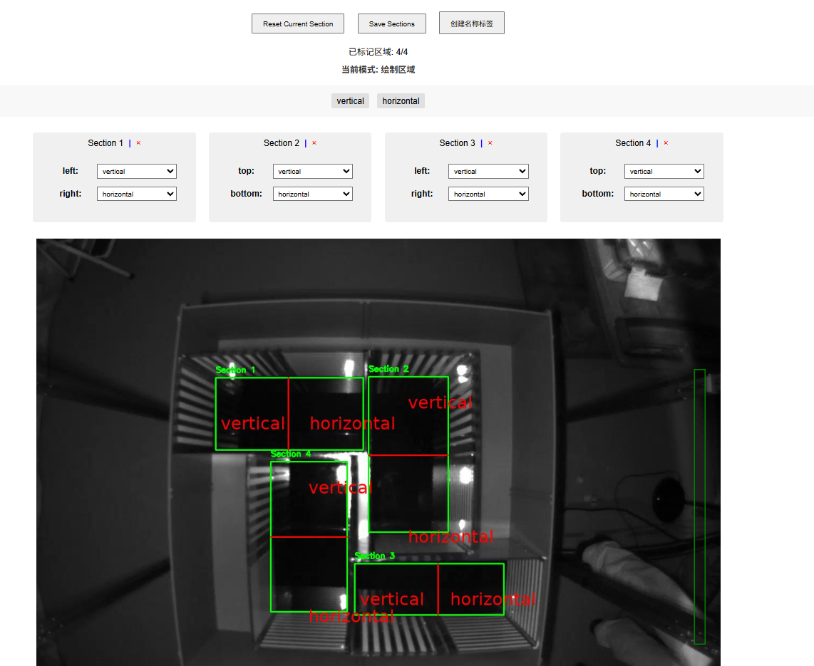

# Mice Detection Project

A computer vision project for mouse behavior detection using YOLO model.

## Environment Setup

This project uses Conda for environment management. Follow these steps to set up the environment:

1. Install [Miniconda](https://docs.conda.io/en/latest/miniconda.html) or [Anaconda](https://www.anaconda.com/download)

2. Create and activate the environment:
```bash
# Create environment
conda env create -f environment.yml

# Activate environment
conda activate mice_detection
```

## Project Structure

```
mice_detection/
├── src/                    # Source code directory
│   ├── inference.py        # Inference script
│   ├── train_yolo.py       # Training script
│   ├── generate_heatmap.py # Heatmap generation
│   ├── mark_sections_web.py # Region marking web interface
│   ├── process_annotations.py # Annotation processing
│   ├── split_dataset.py    # Dataset splitting
│   ├── video_cutter.py     # Video cutting
│   └── templates/          # Web interface templates
├── videos/                 # Directory for input videos
├── processed_data/         # Directory for processed data
│   ├── annotations/        # Annotation files
│   └── labels/            # Label files
├── runs/                  # Directory for model outputs
│   ├── detect/           # Detection results
│   ├── train/            # Training results
│   └── heatmaps/         # Heatmap results
├── environment.yml        # Environment configuration
└── README.md             # Project documentation
```

## Main Features

1. Video object detection
2. Heatmap generation
3. Region marking
4. Dataset processing
5. Model training

### Detection Demo


### Region Marking Interface


## Model

The project includes a pre-trained YOLO model (`best.pt`) for mouse detection, which is stored in the repository at `runs/train/mice_detector/weights/best.pt`. This model can be used directly for inference without additional training.

## Usage

### 1. Video Detection
```bash
# 处理单个视频
python src/inference.py --video <video_path> --model <model_path> --output-dir <output_dir> --conf-thres <confidence_threshold>

# 处理整个文件夹的视频
python src/inference.py --video <video_folder_path> --model <model_path> --output-dir <output_dir> --conf-thres <confidence_threshold>

# 可选参数：
# --no-save-video: 不保存检测结果视频
# --no-save-json: 不保存检测结果JSON
```

### 2. Model Training
```bash
python src/train_yolo.py --data <dataset_config> --epochs <num_epochs>
```

### 3. Generate Heatmap
```bash
python src/generate_heatmap.py --video <video_path> --sections <sections_json> --detections <detection_json> --output-dir <output_dir>

# 可选参数：
# --overlay-dir: 输出叠加热图的视频目录路径
```

### 4. Start Region Marking Web Interface
```bash
python src/mark_sections_web.py --video <video_path> --output <output_json> --port <port_number>

# 参数说明：
# --video: 输入视频路径
# --output: 输出区域标记JSON文件名
# --port: 网页服务器端口（可选，默认自动查找可用端口）
```

## Notes

1. Ensure all dependencies are correctly installed
2. Make sure you have sufficient disk space before use
3. GPU is recommended for training and inference
4. Video file paths may contain spaces, please wrap them in quotes